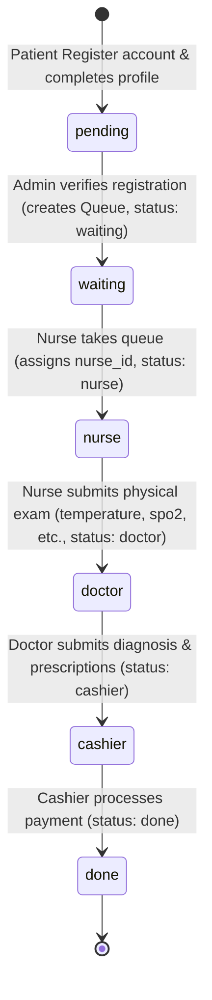

# Klinik Sehat Selalu API 🏥

Klinik Sehat Selalu API adalah sistem backend RESTful API yang aman, andal, dan mengikuti praktik terbaik (best practices) untuk mengelola alur pendaftaran pasien, pemeriksaan fisik mandiri oleh perawat, diagnosis dan resep oleh dokter, hingga transaksi pembayaran oleh kasir di klinik kesehatan.

## Daftar Isi
- [Fitur Utama](#fitur-utama)
- [Arsitektur & Alur State Machine](#arsitektur--alur-state-machine)
- [Keamanan & Validasi](#keamanan--validasi)
- [Prasyarat](#prasyarat)
- [Panduan Instalasi & Konfigurasi](#panduan-instalasi--konfigurasi)
- [Menjalankan Aplikasi](#menjalankan-aplikasi)
- [Menjalankan Pengujian (Testing)](#menjalankan-pengujian-testing)
- [Dokumentasi API](#dokumentasi-api)

---

## Fitur Utama
1. **Autentikasi & Otorisasi Ketat**: Registrasi publik dibatasi hanya untuk pasien. Multi-role RBAC (Role-Based Access Control) mencakup: `admin`, `patient`, `nurse`, `doctor`, `cashier`, `pharmacist`, `administrative`.
2. **Auto-Create Database**: Aplikasi secara otomatis mendeteksi dan membuat database MySQL target jika belum ada saat inisialisasi server.
3. **Validasi Input Menyeluruh**: Menggunakan Joi untuk memeriksa semua tipe data, format string, rentang angka, serta validitas parameter ID di setiap endpoint.
4. **Sanitasi Input Global**: Pembersihan otomatis request params, query, dan body dari potensi serangan Cross-Site Scripting (XSS) dan injeksi HTML/Javascript.
5. **State Machine Workflow**: Memastikan pasien tidak dapat melewati tahapan pemeriksaan klinis secara acak (misal: dokter tidak dapat mendiagnosis jika perawat belum menyelesaikan pemeriksaan fisik).

---

## Arsitektur & Alur State Machine

Aplikasi menggunakan pola MVC (Models, Views/Routes, Controllers) dengan Sequelize ORM. Seluruh alur antrean klinik diatur menggunakan status pada tabel `queues`:



---

## Keamanan & Validasi
- **Hashing Sandi**: Sandi disimpan menggunakan enkripsi satu arah dengan `bcryptjs` (salt 12 rounds) secara otomatis pada saat pendaftaran maupun pembaruan profil.
- **Perlindungan Rate Limiting**: Membatasi laju request per IP guna menghindari serangan DDoS/Brute-Force menggunakan `express-rate-limit`.
- **Security Headers**: Terintegrasi dengan `helmet` untuk menonaktifkan header yang tidak aman dan mengaktifkan Content Security Policy (CSP) serta HTTP Strict Transport Security (HSTS).
- **Sanitasi Data XSS**: Dilakukan di tingkat middleware global untuk menyaring tag HTML berbahaya (`<` dan `>`) serta instruksi script/javascript.

---

## Prasyarat
- [Node.js](https://nodejs.org/) v16 ke atas.
- [MySQL Server](https://www.mysql.com/) (berjalan secara lokal atau di lingkungan Ubuntu WSL).

---

## Panduan Instalasi & Konfigurasi

1. **Clone repository ini** ke direktori lokal Anda.
2. **Instal seluruh dependensi**:
   ```bash
   npm install
   ```
3. **Buat file `.env`**:
   Salin file contoh konfigurasi `.env.example` menjadi `.env`.
   ```bash
   cp .env.example .env
   ```
4. **Sesuaikan file `.env`**:
   Buka file `.env` dan masukkan informasi kredensial database MySQL Anda.
   *Jika MySQL Anda berada di Ubuntu WSL, pastikan port `3306` terbuka atau arahkan `DB_HOST` ke `127.0.0.1` (WSL port-forwarding bekerja secara default).*

    ```env
    DB_HOST=127.0.0.1
    DB_PORT=3306
    DB_NAME=klinik_sehat_selalu
    DB_USER=root
    DB_PASS=password_anda
    PORT=3000
    NODE_ENV=development
    
    # Keamanan & JWT (Gunakan secret acak 32+ karakter di production)
    JWT_SECRET=your-development-secret
    JWT_EXPIRES_IN=24h
    BCRYPT_ROUNDS=12
    
    # Rate Limiting
    RATE_LIMIT_WINDOW_MS=900000
    RATE_LIMIT_MAX=100
    
    # CORS (Batasi ke origin tertentu di production)
    CORS_ORIGIN=http://localhost:3000
    ```

---

## Menjalankan Aplikasi

- **Mode Pengembangan (dengan nodemon auto-restart)**:
  ```bash
  npm run dev
  ```
- **Mode Produksi (menjalankan server langsung)**:
  ```bash
  npm start
  ```

*Saat server pertama kali dijalankan, sistem akan otomatis membuat database jika belum ada, serta melakukan sinkronisasi tabel secara aman (`alter: true`).*

---

## Menjalankan Pengujian (Testing)

Proyek ini dilengkapi dengan skrip uji integrasi alur kerja penuh (end-to-end integration workflow test) menggunakan `jest` dan `supertest`.

1. **Instal alat testing** (jika belum terpasang otomatis):
   ```bash
   npm install --save-dev jest supertest
   ```
2. **Jalankan suite pengujian**:
   ```bash
   npm test
   ```

---

## Dokumentasi API
Detail endpoint, tipe permintaan, struktur respons JSON, serta kebutuhan peran/role otorisasi didokumentasikan lengkap di berkas [API_DOCUMENTATION.md](./API_DOCUMENTATION.md).
